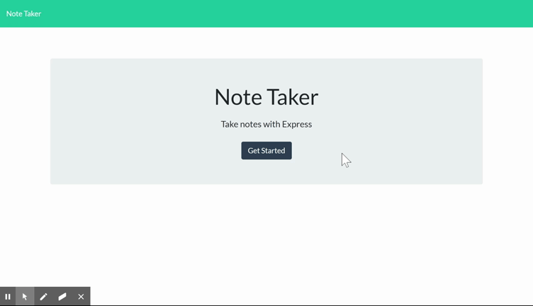

# Note-Taker
## Description
* Note-Taker is an application that allows users to write, save, and delete notes in order to keep tracks of important tasks. With a modern and busy life, Note-Taker is a necessary companion for everyone. 
* Note-Taker was built by me on the server side with a given frontend.
## Usage
Note-Taker is an user-friendly application. When first arriving to the website, users can click `Get Started` button to start writing new notes. On the `notes` page, user simply types in their notes in `Note text` area. They can also create a title for their notes in `Note Title`. When done, click `save` icon on the top right corner to save notes. If users want to write new notes, click `pen` icon that is next to `save` icon to do so. Saved notes can be re-visited in the future. When done with a note, click `trash` icon to delete it from the saved notes. 
## Demo

## Deployed Website
https://easy-note-taker.herokuapp.com/
## Tech
* HTML
* CSS
* JAVASCRIPT
* NODE.JS
* HEROKU
## Question 
* Github account: https://github.com/sarah-nguyen1993
* If you have any questions, send me an email at dudu.nt107@gmail.com 
## License 
 
